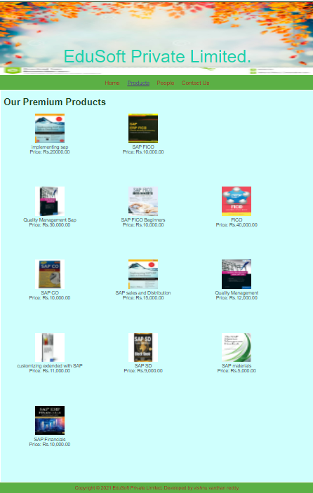
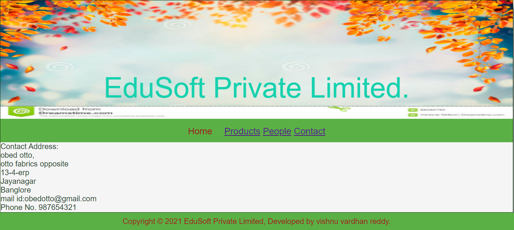

# Web Design for a Software Product Company

## AIM:

To design a static website for a software product company company.

## DESIGN STEPS:

### Step 1:

Requirement collection.

### Step 2:

Creating the layout using HTML and CSS.

### Step 3:

Updating the sample content.

### Step 4:

Choose the appropriate style and color scheme.

### Step 5:

Validate the layout in various browsers.

### Step 6:

Validate the HTML code.

### Step 6:

Publish the website in the given URL.

## PROGRAM :-
 1.Home Page :
```
<!DOCTYPE html>
<html lang="en">
  <head>
    <title>EduSoft Private Limited</title>
    <link rel="stylesheet" href="./css/layout.css" />
    <link rel="icon" href="./img/icon.png" type="image/x-icon" />
  </head>

  <body>
    <div class="container">
      <div class="banner">EduSoft Private Limited.</div>
      <div class="menu">
        <div class="menuitemselected"><a href="/static/home.html">Home</a></div>
        <div class="menuitem"><a href="/static/products.html">Products</a></div>
        <div class="menuitem"><a href="/static/people.html">People</a></div>
        <div class="menuitem"><a href="/static/Contact Us">Contact Us</a></div>
      </div>
      <div class="content">
        <div class="homecontent">
          <h1>About us</h1>
          
          <div class="contenttext">
            At Tally, we believe in the power of technology to make business
            owners efficient, empowered and happier, so they can focus on what
            matters most for their business. We design our products to focus on
            just that to make our products work for you, and not the other way
            around.
            <br />
            Our new product TallyPrime takes this to a new level, making your
            start to automation, or your switch to Tally simpler than ever
            before. You can now discover the product much more easily and make
            the product do more for you, without learning anything new. There is
            greater flexibility as the product adapts to your business and your
            way of working. And the transformed look and feel will only make you
            love the product even more.
            <ul>
              <li>Simple to learn, easier to use</li>
              <li>Insightful , actionable & customizable reports</li>
              <li>Anywhere, anytime and secure access</li>
            </ul>
          </div>
        </div>
      </div>
      <div class="footer">
        Copyright &#169; 2021 EduSoft Private Limited, Developed by vishnu vardhan reddy.
      </div>
    </div>
  </body>
</html>
```
2.Products Page :
```
<!DOCTYPE html>
<html lang="en">
  <head>
    <title>EduSoft Private Limited</title>
    <link rel="stylesheet" href="./css/layout.css" />
    <link rel="icon" href="./img/icon.png" type="image/x-icon" />
  </head>

  <body>
    <div class="container">
      <div class="banner">EduSoft Private Limited.</div>
      <div class="menu">
        <div class="menuitem"><a href="/static/home.html">Home</a></div>
        <div class="menuitemselected">
          <a href="/static/products.html">Products</a>
        </div>
        <div class="menuitem"><a href="/static/people.html">People</a></div>
        <div class="menuitem"><a href="/static/Contact.html">Contact Us</a></div>
      </div>
      <div class="content">
        <div class="productcontent">    
          <h1>Our Premium Products</h1>
          <div class="productitems">
              <div class="productitem"> 
                  <div class="itemimage">
                  
                  </div>
                  <div class="itemname">implementing sap</div>
                  <div class="itemprice">Price: Rs.20000.00 </div>
              </div>
              <div class="productitem"> 
                  <div class="itemimage">
                  
                  </div>
                  <div class="itemname">SAP FICO</div>
                  <div class="itemprice">Price: Rs.10,000.00 </div>
              </div>
          </div>
          <div class="productitem"> 
            <div class="itemimage">
            
            </div>
            <div class="itemname">Quality Management Sap</div>
            <div class="itemprice">Price: Rs.30,000.00 </div>
        </div>
        <div class="productitem"> 
          <div class="itemimage">
          
          </div>
          <div class="itemname">SAP FICO Beginners</div>
          <div class="itemprice">Price: Rs.10,000.00 </div>
      </div>
      <div class="productitem"> 
        <div class="itemimage">
        
        </div>
        <div class="itemname">FICO</div>
        <div class="itemprice">Price: Rs.40,000.00 </div>
    </div>
    <div class="productitem"> 
      <div class="itemimage">
      
      </div>
      <div class="itemname">SAP CO</div>
      <div class="itemprice">Price: Rs.10,000.00 </div>
  </div>
  <div class="productitem"> 
    <div class="itemimage">
    
    </div>
    <div class="itemname">SAP sales and Distribution</div>
    <div class="itemprice">Price: Rs.15,000.00 </div>
</div>
<div class="productitem"> 
  <div class="itemimage">
  
  </div>
  <div class="itemname">Quality Management</div>
  <div class="itemprice">Price: Rs.12,000.00 </div>
</div>
<div class="productitem"> 
  <div class="itemimage">
  
  </div>
  <div class="itemname">customizing extended with SAP</div>
  <div class="itemprice">Price: Rs.11,000.00 </div>
</div>
<div class="productitem"> 
  <div class="itemimage">
  
  </div>
  <div class="itemname">SAP SD</div>
  <div class="itemprice">Price: Rs.9,000.00 </div>
</div>
<div class="productitem"> 
  <div class="itemimage">
  
  </div>
  <div class="itemname">SAP materials</div>
  <div class="itemprice">Price: Rs.5,000.00 </div>
</div>
<div class="productitem"> 
  <div class="itemimage">
  
  </div>
  <div class="itemname">SAP Financials</div>
  <div class="itemprice">Price: Rs.10,000.00 </div>
</div>

          </div>        
      </div>
      <div class="footer">
        Copyright &#169; 2021 EduSoft Private Limited, Developed by vishnu vardhan reddy.
      </div>
    </div>
  </body>
</html>
```
3.Peoples Page : 
```
<!DOCTYPE html>
<html lang="en">
  <head>
    <title>EduSoft Private Limited</title>
    <link rel="stylesheet" href="./css/layout.css" />
    <link rel="icon" href="./img/icon.png" type="image/x-icon" />
  </head>

  <body>
    <div class="container">
      <div class="banner">EduSoft Private Limited.</div>
      <div class="menu">
        <div class="menuitem"><a href="/static/home.html">Home</a></div>
        <div class="menuitemselected">
          <a href="/static/products.html">Products</a>
          <a href="/static/people.html">People</a>
          <a href="/static/Contact Us.html">Contact</a>
        </div>
      </div>
      <div class="content">
        <div class="productcontent">    
          <h1>OUR OWNERS</h1>
          <div class="productitems">
              <div class="productitem"> 
                  <div class="itemimage">
                  
                  </div>
                  <div class="itemname">Glynn c.Williams</div>
              </div>
              <div class="productitem"> 
                  <div class="itemimage">
                  
                  </div>
                  <div class="itemname">Andrew okungbowa</div>
              </div>
          </div>
          <div class="productitem"> 
            <div class="itemimage">
            
            </div>
            <div class="itemname">Murugesan Ramaswamy</div>
        </div>
        <div class="productitem"> 
          <div class="itemimage">
          
          </div>
          <div class="itemname">Krishna Rungta</div>
      </div>
      <div class="productitem"> 
        <div class="itemimage">
        
        </div>
        <div class="itemname">V.Narayanan</div>
    </div>
    <div class="productitem"> 
      <div class="itemimage">
      
      </div>
      <div class="itemname">Jawad Akhtar</div>
  </div>
          </div>        
      </div>
      <div class="footer">
        Copyright &#169; 2021 EduSoft Private Limited, Developed by vishnu vardhan reddy.
      </div>
    </div>
  </body>
</html>
```
4.Contact Us :
```
<!DOCTYPE html>
<html lang="en">
  <head>
    <title>EduSoft Private Limited</title>
    <link rel="stylesheet" href="./css/layout.css" />
    <link rel="icon" href="./img/icon.png" type="image/x-icon" />
  </head>
  <body>
    <div class="container">
      <div class="banner">EduSoft Private Limited.</div>
      <div class="menu">
        <div class="menuitem"><a href="/static/home.html">Home</a></div>
        <div class="menuitemselected">
          <a href="/static/products.html">Products</a>
          <a href="/static/people.html">People</a>
          <a href="/static/Contact Us.html">Contact</a>
        </div>
      </div>
  <body>
      Contact Address:
      <br/>
      obed otto,
      <br/>
      otto fabrics opposite
      <br/>
      13-4-erp
      <br/> 
      Jayanagar
      <br/>
      Banglore
      <br/>
      mail id:obedotto@gmail.com
      <br/>
    Phone No. 987654321
</div>        
      </div>
      <div class="footer">
        Copyright &#169; 2021 EduSoft Private Limited, Developed by vishnu vardhan reddy.
      </div>
    </div>
  </body>
</html>
```
## OUTPUT:

### Home Page:







## Result:

Thus a website is designed for the software product company and the HTML,CSS code are validated.
